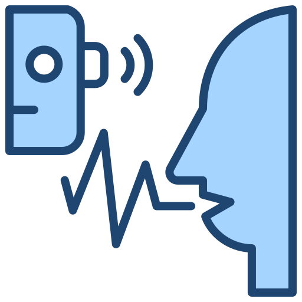
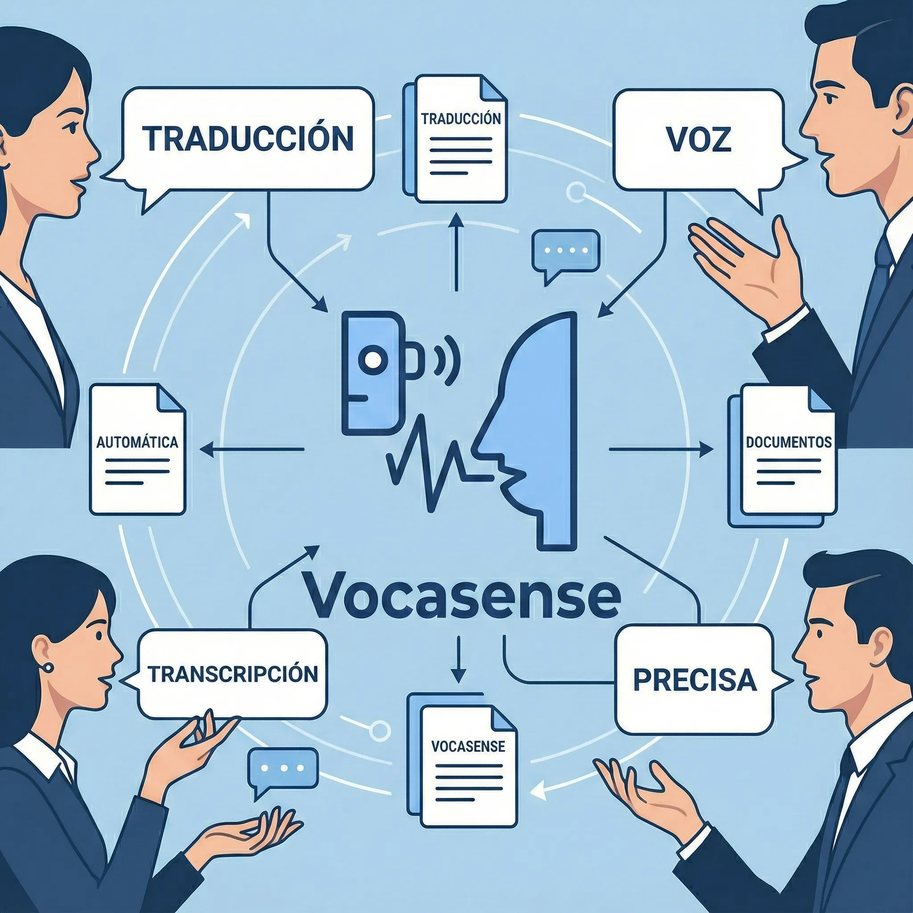
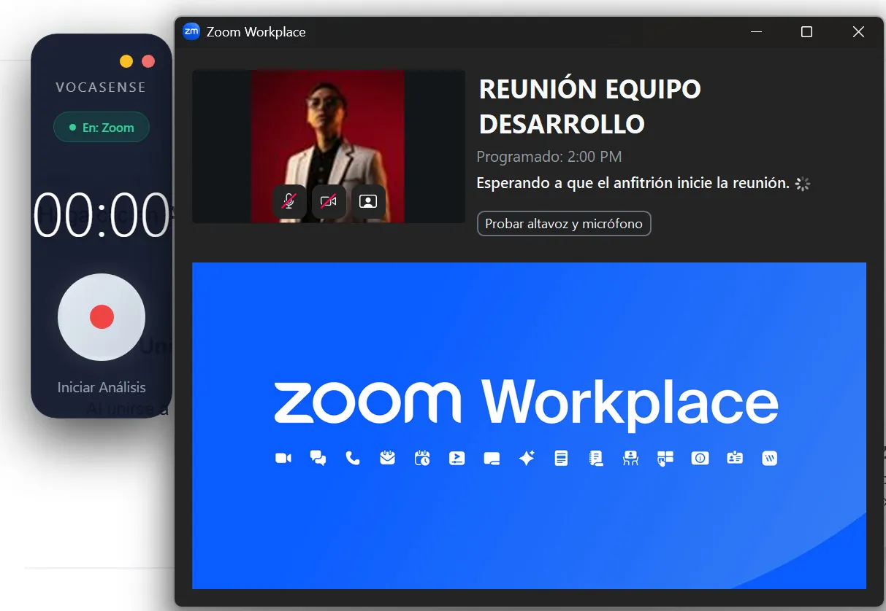
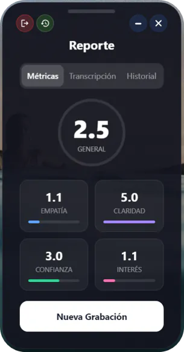

# 🌟 VocaSense Landing Page

[](https://opensource.org/licenses/MIT)
[](https://html.spec.whatwg.org/)
[](https://www.w3.org/Style/CSS/)
[](https://getbootstrap.com/)
[](https://developer.mozilla.org/en-US/docs/Web/JavaScript)

> **Página de aterrizaje oficial de VocaSense** - La herramienta definitiva para gestionar grabaciones inteligentes en entornos profesionales.



## 📖 Descripción

VocaSense es una aplicación innovadora diseñada para profesionales que necesitan grabar, transcribir y analizar reuniones de manera eficiente y privada. Esta landing page presenta todas las características de VocaSense, tutoriales interactivos, y enlaces de descarga para Windows, macOS y Linux.

La página está optimizada para una experiencia fluida, con videos de demostración, galerías de imágenes y modales informativos sobre privacidad, términos de uso y manual técnico.

## ✨ Características Principales

### 🎯 Funcionalidades Destacadas

- **Transcripción Ilimitada**: Graba horas sin cortes ni restricciones
- **Privacidad Total**: Grabación local vía hardware, sin bots intrusivos
- **Métricas Avanzadas**: Análisis de sentimientos y participación en tiempo real
- **Infraestructura Robusta**: Datos seguros en Azure y Supabase
- **Exportación Flexible**: Descarga en TXT, JSON o copia directa
- **Multiplataforma**: Compatible con Windows, macOS y Linux
- **Motor de IA**: Precisión del 99% en Español y 90% en Spanglish

### 🎨 Diseño y UX

- **Interfaz Intuitiva**: Diseño limpio y moderno con Bootstrap 5
- **Responsive**: Optimizado para desktop, tablet y móvil
- **Videos Interactivos**: Tutoriales paso a paso con controles nativos
- **Galería Dinámica**: Modal de imágenes con descripciones detalladas
- **Animaciones Suaves**: Efectos hover y transiciones fluidas

### 🔧 Optimización Técnica

- **Imágenes Optimizadas**: Conversión automática a WebP y JPEG optimizado
- **Videos Comprimidos**: Reducción de tamaño manteniendo calidad
- **Lazy Loading**: Carga diferida para mejor rendimiento
- **SEO Friendly**: Meta tags y estructura semántica

## 🖼️ Capturas de Pantalla

### Hero Section



### Interfaz de Grabación



### Análisis de Métricas



## 🛠️ Tecnologías Utilizadas

- **Frontend**:
  - HTML5
  - CSS3 con Bootstrap 5.3.0
  - JavaScript (ES6+)
  - Font Awesome 6.4.0

- **Optimización**:
  - Node.js con Sharp para imágenes
  - Scripts personalizados para videos
  - Conversión a WebP

- **Dependencias**:
  - `sharp`: ^0.33.0 para procesamiento de imágenes

## 🚀 Instalación y Uso

### Prerrequisitos

- Node.js (versión 14 o superior)
- npm o yarn

### Instalación

```bash
# Clonar el repositorio
git clone https://github.com/M1zukodm/VocaSense-Landing.git
cd VocaSense-Landing

# Instalar dependencias
npm install

# Optimizar assets (opcional)
npm run optimize
```

### Scripts Disponibles

```bash
# Optimizar todas las imágenes y videos
npm run optimize

# Solo imágenes
npm run optimize:images

# Solo videos
npm run optimize:videos

# Convertir a WebP
npm run webp

# Ver estadísticas de tamaño
npm run stats
```

### Despliegue

La página es completamente estática y puede desplegarse en:

- GitHub Pages
- Netlify
- Vercel
- Cualquier servidor web

## 📁 Estructura del Proyecto

```
VocaSense-Landing/
├── index.html              # Página principal
├── css/
│   └── styles.css          # Estilos personalizados
├── js/
│   └── main.js             # JavaScript interactivo
├── assets/
│   ├── img/                # Imágenes originales y optimizadas
│   │   ├── optimized/      # JPEG optimizados
│   │   └── webp/           # Versiones WebP
│   └── media/              # Videos de demostración
│       └── optimized/      # Videos comprimidos
├── optimize.js             # Script de optimización de imágenes
├── optimize-videos.js      # Script de optimización de videos
├── package.json            # Dependencias y scripts
└── README.md               # Este archivo
```

## 🎥 Videos de Demostración

La página incluye varios videos tutoriales:

- **Primeros Pasos**: Registro y validación de cuenta
- **Ajustes de Audio**: Configuración de mezcla estéreo
- **Prueba Práctica**: Grabación y procesamiento
- **Generación de Resúmenes**: Uso de IA para resúmenes
- **Demostración en macOS**: Compatibilidad multiplataforma

## 🔒 Privacidad y Legal

- **Política de Privacidad**: Datos locales, no compartidos sin consentimiento
- **Términos de Uso**: Responsabilidad del usuario en grabaciones
- **Consentimiento Obligatorio**: Aviso a participantes antes de grabar

## 🤝 Contribuir

¡Las contribuciones son bienvenidas! Para contribuir:

1. Fork el proyecto
2. Crea una rama para tu feature (`git checkout -b feature/AmazingFeature`)
3. Commit tus cambios (`git commit -m 'Add some AmazingFeature'`)
4. Push a la rama (`git push origin feature/AmazingFeature`)
5. Abre un Pull Request

### Guías de Contribución

- Mantén el código limpio y comentado
- Optimiza imágenes y videos antes de subir
- Prueba en múltiples navegadores
- Sigue las mejores prácticas de accesibilidad

## 📄 Licencia

Este proyecto está bajo la Licencia MIT - ver el archivo [LICENSE](LICENSE) para más detalles.

## 📞 Contacto

- **Proyecto**: [VocaSense Landing](https://github.com/M1zukodm/VocaSense-Landing)
- **Aplicación**: [VocaSense App](https://github.com/M1zukodm/VocaSense)
- **Descargas**: Disponible en releases del repositorio de la app

---

<div align="center">
  <p>⭐ Si te gusta este proyecto, ¡dale una estrella!</p>
  <p>Desarrollado con ❤️ por el equipo de ROMI</p>
</div>
